# Herramientas_Big_Data
Trabajamos con herramientas de Big Data

<p>
  
</p>

Durante esta practica la idea es imitar un ambiente de trabajo. Desde un área de innovación, solicitan construir un MVP(Producto viable mínimo) de un ambiente de Big Data donde se deban cargar unos archivos CSV que anteriormente se utilizaban en un datawarehouse en MySQl, pero ahora en un entorno de Hadoop.

Desde la gerencia de Infraestructura no están muy convencidos de utilizar esta tecnología, por lo que no se asigno presupuesto alguna para esta iniciativa, de forma tal que por el momento no es posible utilizar un Vendor(Azure, AWS, Google) para implementar dicho entorno. Es por esto, que todo el MVP se deberá implementar utilizando Docker de forma tal que se pueda hacer una demo al sector de infraestructura mostrando las ventajas de utilizar tecnologías de Big Data.


# Entorno Docker con Hadoop, Spark y Hive

Se pesenta un entorno Docker con Hadoop (HDFS) y la implementación de:
* Spark
* Hive
* HBase
* MongoDB
* Neo4J
* Zeppelin
* Kafka

Es importante mencionar que el entorno completo consume muchos recursos de su equipo, motivo por el cuál se proponen ejercicios pero con ambientes reducidos, en función de las herramientas utilizadas.

### Nota: Esta practica fue desarrollada en una máquna virtual en VirtualBox con el Servidor Ubuntu prediseñado, en el cual ya viene instalado Docker. Las herramientas que utilice son VirtualBox, Putty, WinSCP.

# Proceso inicial

Primer paso fundamental, para implementar debemos clonar el repositorio en nuestra máquina virtual:

    git clone https://github.com/Rolizet/Herramientas_Big_Data.git

Luego, nos ubicamos en la carpeta de la practica con el comando cd:

```
cd DS-M4-Herramientas_Big_Data
```


<p>
  
</p>

Ejecute `docker network inspect` en la red (por ejemplo, `docker-hadoop-spark-hive_default`) para encontrar la IP en la que se publican las interfaces de hadoop. Acceda a estas interfaces para ver el proceso con las siguientes URL:

```
Namenode: http://<IP_Anfitrion>:9870/dfshealth.html#tab-overview
Datanode: http://<IP_Anfitrion>:9864/
Spark master: http://<IP_Anfitrion>:8080/
Spark worker: http://<IP_Anfitrion>:8081/	
HBase Master-Status: http://<IP_Anfitrion>:16010
HBase Zookeeper_Dump: http://<IP_Anfitrion>:16010/zk.jsp
HBase Region_Server: http://<IP_Anfitrion>:16030
Zeppelin: http://<IP_Anfitrion>:8888
Neo4j: http://<IP_Anfitrion>:7474
```

## 1) HDFS


### Ejecución de entorno

Ejecutamos la version 1 del entorno docker-compose: 

```
sudo docker-compose -f docker-compose-v1.yml up -d
```

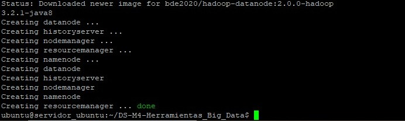


### Copia de los archivos ubicados en 'Datasets' al contenedor 'namenode'

Creamos el directorio 'Datasets' dentro del namenode y salimos del mismo, siga los pasos:

Ubicarse en el contenedor "namenode" una vez iniciado el contenedor.

```
sudo docker exec -it namenode bash
```

```
cd home
```

Creamos el directorio Datasets con el comando mkdir

```
mkdir Datasets
```
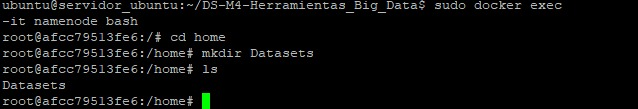

```
exit
```

Ejecutamos el archivo 'Paso00.sh', que contiene los comandos para copiar los archivos al namenode. Primero le damos permiso de ejecución con chmod:

```
sudo chmod +x Paso00.sh
```

Ejecutar el archivo:

```
sudo ./Paso00.sh
```
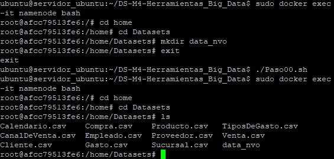

Ingresamos al contenedor 'namenode':

```
sudo docker exec -it namenode bash
```

Nos ubicamos en el directorio 'home':

```
cd home
```

Creamos el directorio 'data':

```
hdfs dfs -mkdir -p /data
```

Pegamos los archivos:

```
hdfs dfs -put /home/Datasets/* /data
```

**Podemos ingresar a la interfaz de hadoop para verificar que los archivos esten en el HDFS. Para hacerlo podemos usar nuestro navegador, pegamos la IP de nuestra máquina virtual y luego el puerto :9870. Un vez dentro, nos dirigimos a *Utilities > Browse the file system. Si cumpliste con todos los pasos anteriores, deberias visualizar la carpeta data con los archivos .csv **

Ejemplo:

```
http://xxx.xxx.x.xxx:9870/
```
### Nota: Reemplazamos las xxx con nuestra IP

 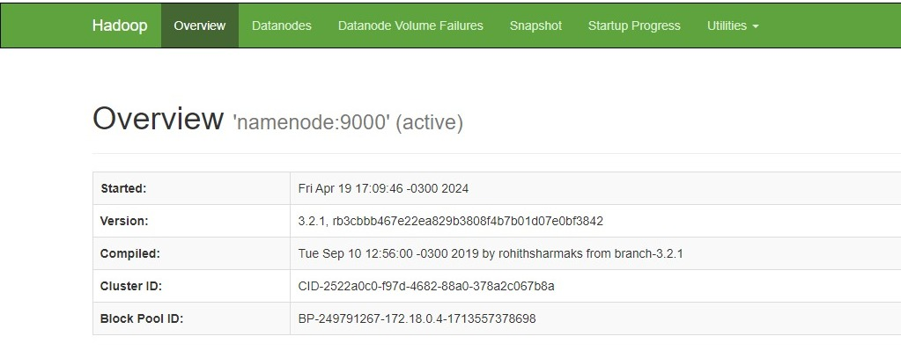

 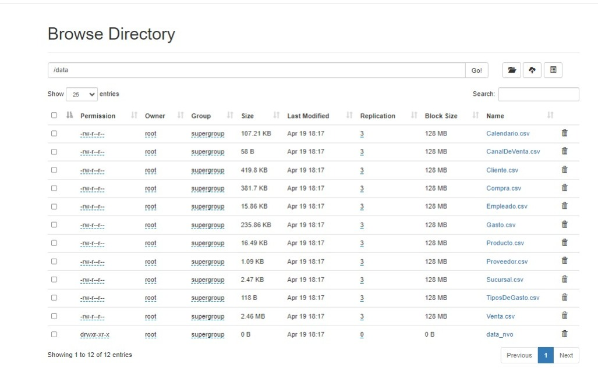


2) Hive


Aqui debemops crear tablas en Hive a partir de los csv ingestados en HDFS.
Para este paso, debemos usar el entorno docker-compose-v2 y es necesario detener el anterior. Vamos a detener todos los contenedores:

```
sudo docker stop $(sudo docker ps -a -q)
```

Par continuar, debemos estar parados en el directorio 'DS-M4-Herramientas_Big_Data':

```
cd DS-M4-Herramientas_Big_Data
```

Ejecutamos el entorno que necesitamos para este paso:

```
sudo docker-compose -f docker-compose-v2.yml up -d
```

### Creación y población de las tablas

**Vamos a ejecutar el script 'Paso02.hql' para crear y poblar las tablas, por lo tanto el primer paso es copiarlo de nuestra máquina virtual e ingestarlo en el server de Hive:**

```
sudo docker cp ./Paso02.hql hive-server:/opt/
```

Ingresamos al server de Hive:

```
sudo docker exec -it hive-server bash
```

Ejecutamos el script configurado previamente para crear y poblar las tablas:

```
hive -f Paso02.hql
```
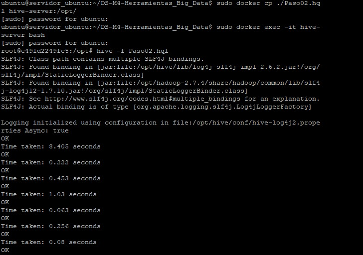

**Podemos corroborar mediante consultas en hive que las tablas se crearon y poblaron con éxito:**

Ingresar a Hive:
```
hive
```

Realizar las consultas:
```
use integrador;
```

```
select COUNT(*) from venta;
```

***Nota: es importante establecer la cláusula limit ya que la mayoría de las tablas tienen miles de registros***

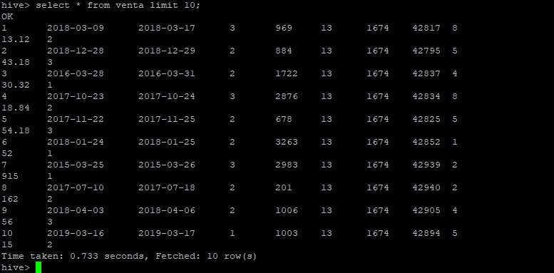

## 3) Formatos de Almacenamiento


Vamos a crear una nueva base de datos en la cual vamos a alojar todas las tablas creadas en el punto 2, almacenadas en formato **Parquet + Snappy** aplicando particiones para algunas tablas.

El primer paso es copiar el archivo 'Paso03.hql' al servidor de Hive. Este archivo crea una base de datos llamada integrador2 que modifica la informacion y la guarda en formato Parquet con compresion de tipo Snappy.

Comenzamos subiendo el archivo hql al contenedor de Hive.

```
sudo docker cp ./Paso03.hql hive-server:/opt/
```

Ingresamos al servidor de Hive y ejecutamos el archivo 'Paso03.hql':

```
sudo docker exec -it hive-server bash
```

```
hive -f Paso03.hql
```

*Es recomendable revisar el script Paso03.hql para ver y comprender que estamos ejecutando*

### Consultas para verificar que las tablas se crearon y poblaron

Ingresamos a Hive y seleccionamos la DB 'integrador2':

```
hive
```

```
use integrador2;
```

```
show tables;
```

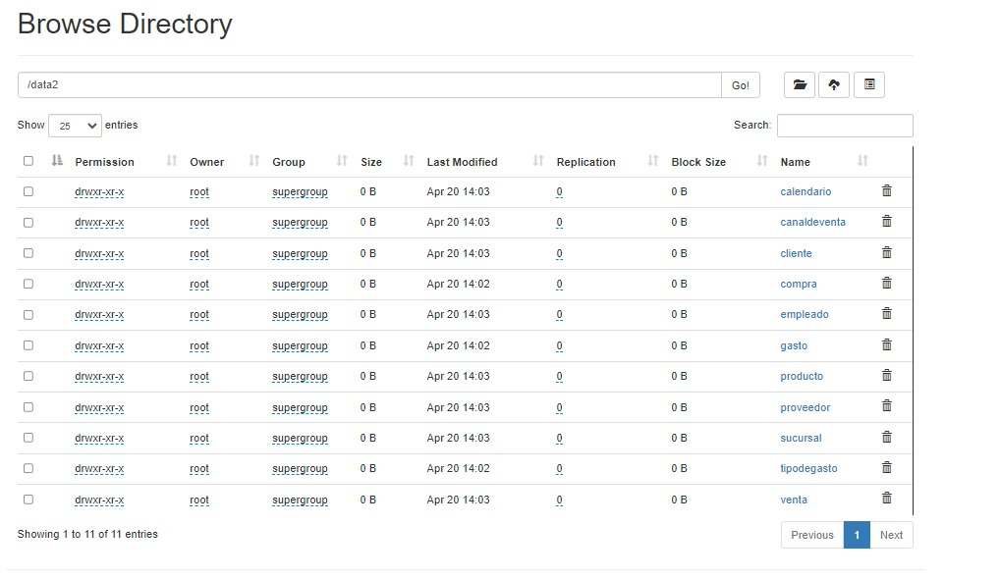


#### Consultas

```
select IdTipoGasto, sum(Monto) from gasto group by IdTipoGasto;
```

```
select COUNT(*) from calendario;
```

```
select COUNT(*) from proveedor;
```

## 4) SQL


En esta etapa del trabajo vamos a crear indices. Es importante tener en cuenta que la mejora en la velocidad de consulta que puede proporcionar un índice tiene el costo del procesamiento adicional para crear el índice y el espacio en disco para almacenar las referencias del índice.

#### Probamos consultas con funciones de agregado en la tabla venta y registramos el tiempo:

```
select IdProducto, SUM(Precio * Cantidad) FROM venta GROUP BY IdProducto;
```
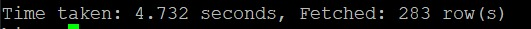

```
select IdCliente, SUM(Precio * Cantidad) FROM venta GROUP BY IdCliente;
```


Crear índices en alguna de las tablas cargadas y probar los resultados:

```
CREATE INDEX index_venta_producto ON TABLE venta(IdProducto) AS 'org.apache.hadoop.hive.ql.index.compact.CompactIndexHandler' WITH DEFERRED REBUILD;
```

```
CREATE INDEX index_venta_cliente ON TABLE venta(IdCliente) AS 'org.apache.hadoop.hive.ql.index.compact.CompactIndexHandler' WITH DEFERRED REBUILD;
```

#### Repetimos las consultas y comparamos los tiempos:

```
select IdProducto, SUM(Precio * Cantidad) FROM venta GROUP BY IdProducto;
```
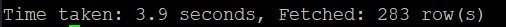

```
select IdCliente, SUM(Precio * Cantidad) FROM venta GROUP BY IdCliente;
```
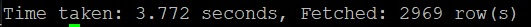

## 5) No-SQL


### Ejecución de entorno

En el paso 5 vamos a utilizar **HBase, MongoDB, Neo4J y Zeppelin** por lo que vamos a detener los contenedores que estabamos utilizando para continuar trabajando:

```
sudo docker stop $(sudo docker ps -a -q)
```

Para este paso vamos a ejecutar la versión 3 de docker-compose que contiene lo necesario para el ejercicio:

```
sudo docker-compose -f docker-compose-v3.yml up -d
```

### 1) HBase

Ingresamos al shell:

```
sudo docker exec -it hbase-master hbase shell
```

Creamos las siguientes tablas:

```
create 'personal','personal_data'
```

```
list 'personal'
```

1-Ingresamos los datos:

```
put 'personal',1,'personal_data:name','Juan'
```

```
put 'personal',1,'personal_data:city','Córdoba'
```

```
put 'personal',1,'personal_data:age','25'
```

```
put 'personal',2,'personal_data:name','Franco'
```

```
put 'personal',2,'personal_data:city','Lima'
```

```
put 'personal',2,'personal_data:age','32'
```

```
put 'personal',3,'personal_data:name','Ivan'
```

```
put 'personal',3,'personal_data:age','34'
```

```
put 'personal',4,'personal_data:name','Eliecer'
```

```
put 'personal',4,'personal_data:city','Caracas'
```

2-Pegamos el archivo personal.csv en el namenode del cluster:

```
hdfs dfs -put personal.csv /hbase/data/personal.csv
```

3- Ingresamos al bash de Hbase:

```
sudo docker exec -it hbase-master bash
```

```
hbase org.apache.hadoop.hbase.mapreduce.ImportTsv -Dimporttsv.separator=',' -Dimporttsv.columns=HBASE_ROW_KEY,personal_data:name,personal_data:city,personal_data:age personal hdfs://namenode:9000/hbase/data/personal.csv
```	

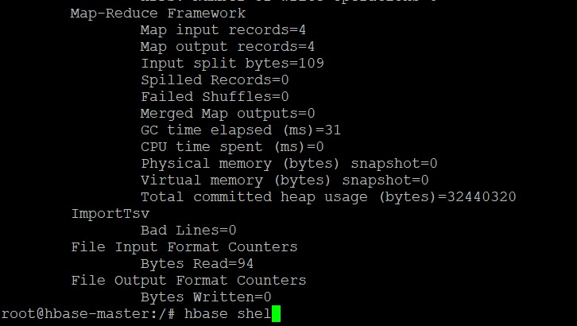

Ejecutamos los siguientes comandos para crear una tabla:

```
hbase shell
```
		scan 'personal'
		create 'album','label','image'
		put 'album','label1','label:size','10'
		put 'album','label1','label:color','255:255:255'
		put 'album','label1','label:text','Family album'
		put 'album','label1','image:name','holiday'
		put 'album','label1','image:source','/tmp/pic1.jpg'
		get 'album','label1'

2) MongoDB

Instrucciones:

1) Copiamos los archivos a mongodb:

        sudo docker cp iris.csv mongodb:/data/iris.csv
		sudo docker cp iris.json mongodb:/data/iris.json

2) Ingresamos al bash de mongodb:

        sudo docker exec -it mongodb bash

3) Importamos los archivos de tipo csv y json desde mongo a la base de datos dataprueba:

        mongoimport /data/iris.csv --type csv --headerline -d dataprueba -c iris_csv
		mongoimport --db dataprueba --collection iris_json --file /data/iris.json --jsonArray

4) Hacemos consultas entrando a mongosh
		use dataprueba
		show collections
		db.iris_csv.find()
		db.iris_json.find()

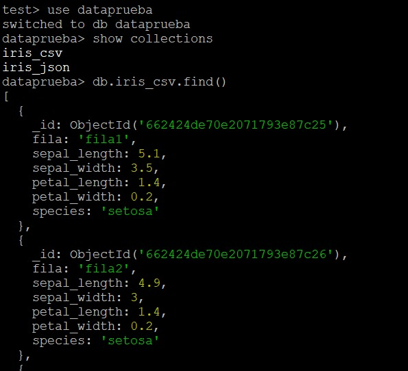

5) Ejecutamos las siguientes líneas en el bash para exportar los documentos:

        mongoexport --db dataprueba --collection iris_csv --fields sepal_length,sepal_width,petal_length,petal_width,species --type=csv --out /data/iris_export.csv
		mongoexport --db dataprueba --collection iris_json --fields sepal_length,sepal_width,petal_length,petal_width,species --type=json --out /data/iris_export.json

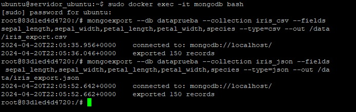

        exit

Copiamos los archivos .jar de la carpeta 'Mongo' a la librería de Hive y al HDFS:

    cd DS-M4-Herramientas_Big_Data

```
sudo docker cp ./Mongo/. hive-server:/opt/hive/lib/
```

```
sudo docker cp ./Mongo/. namenode:/tmp/udfs/
```

```
sudo docker exec -it namenode bash
```

```
cd tmp
```

```
cd udfs
```

```
hadoop fs -copyFromLocal mongo* /tmp/hive/
```

```
exit
```

Verificamos que se hayan copiado bien y tengan permisos de lectura:

```
sudo docker exec namenode hadoop fs -ls /tmp/hive/
```

Nos vamos a hive-server, iniciamos hiveserver2 e ingresamos a hive:

```
sudo docker exec -it hive-server bash
```

```
hiveserver2
```

```
hive
```

Añadimos los archivos .jar al path desde hive:

```
ADD JAR hdfs://namenode:9000/tmp/hive/mongo-java-driver-3.12.11.jar;
ADD JAR hdfs://namenode:9000/tmp/hive/mongo-hadoop-core-2.0.2.jar;
ADD JAR hdfs://namenode:9000/tmp/hive/mongo-hadoop-hive-2.0.2.jar;
ADD JAR hdfs://namenode:9000/tmp/hive/mongo-hadoop-spark-2.0.2.jar;
```

3) Neo4J
Revisa el siguiente link para comprender que haremos en la siguiente actividad:

	https://neo4j.com/docs/graph-data-science/current/algorithms/dijkstra-source-target/

Uso del algoritmo Dijkstra:

Es utilizado para encontrar el camino mas corto desde un vertice(nodos) de origen dado a todos los demas vertices en un grafo ponderado donde cada arista tiene asociado un peso o valor numerico. El peso representa alguna medida, por ejemplo: distancia. En los soguientes pasos de la actividad, vamos a ilustrar un ejemplo en un grafo.

1) Levantamos nuestro entorno docker-compose-v3.yml

```
sudo docker-compose -f docker-compose-v3.yml up -d
```

2) Una vez dentro del bash de hive-server, ingresamos a hive con los permisos necesarios realizados en el paso anterior de mongo para leer el archivo iris.hql, hago lo siguiente para crear el grafo en la base de datos Neo4j: 

CREATE (a:Location {name: 'A'}), (b:Location {name: 'B'}), (c:Location {name: 'C'}), (d:Location {name: 'D'}), (e:Location {name: 'E'}), (f:Location {name: 'F'}), (a)-[:ROAD {cost: 50}]->(b), (b)-[:ROAD {cost: 50}]->(a), (a)-[:ROAD {cost: 50}]->(c), (c)-[:ROAD {cost: 50}]->(a), (a)-[:ROAD {cost: 100}]->(d), (d)-[:ROAD {cost: 100}]->(a), (b)-[:ROAD {cost: 40}]->(d), (d)-[:ROAD {cost: 40}]->(b), (c)-[:ROAD {cost: 40}]->(d), (d)-[:ROAD {cost: 40}]->(c), (c)-[:ROAD {cost: 80}]->(e), (e)-[:ROAD {cost: 80}]->(c), (d)-[:ROAD {cost: 30}]->(e), (e)-[:ROAD {cost: 30}]->(d), (d)-[:ROAD {cost: 80}]->(f), (f)-[:ROAD {cost: 80}]->(d), (e)-[:ROAD {cost: 40}]->(f), (f)-[:ROAD {cost: 40}]->(e);

